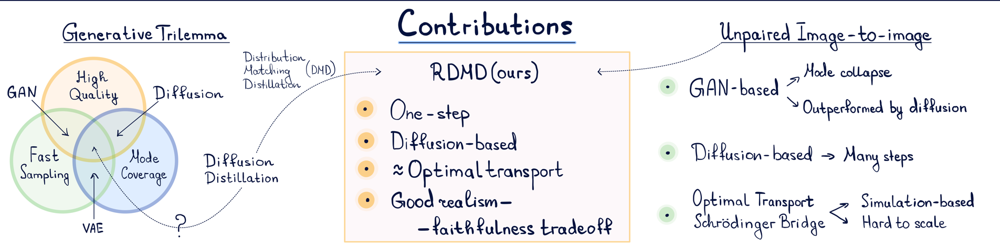
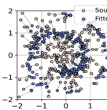
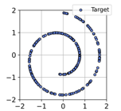

# Regularized Distribution Matching Distillation for One-step Unpaired Image-to-image Translation

Denis Rakitin$^{1}$, Ivan Shchekotov$^{2}$, Dmitry Vetrov$^{3}$

Skoltech

CONSTRUCTOR

UNIVERSITY

## Unpaired Image-to-image Translation

$$ Optimal transport (OT) problem $$

$$\left\{\begin{array}{l}
E_{p(x)} c(x, G(x)) \to \min _{G} \\
G(x) \sim p^{\tau}
\end{array}\right.$$

Performance example

### Diffusion Models

- $\bullet$ $x_t = x_0 + 6 \xi E - noisy observations$
$\boxed{\text{Training (Denoising Score Matching)}}$
$\bullet$ $\int_0^T \beta_t \mathbb{E}_{p_{t}(x_0,x_t)} \left\| D_t^\circ(x_t) - x_0 \right\|^2 dt \to \min_\varrho$ $\boxed{\text{}}$
$\bullet$ $S_t^{\theta^*}(x_t) = \frac{\rho}{6 \xi} (D_t^\circ(x_t) - x_t) \approx \nabla_x \log p_t(x_t)$
### Distribution Matching Distillation

$$ Train one-step generator  G_{\theta}(z) $$

$$\odot \mathcal{L}(\theta)=\int_{0}^{T} \omega_{t} K L\left(P_{t}^{\theta} \| P_{t}^{real }\right) d t$$

$$ Joint training $$

$$\bullet \quad \nabla_{\theta} \mathcal{L}(\theta) \approx\left(\zeta_{t}^{\theta}(\cdot )-\zeta_{t}^{real }(\cdot )\right) \nabla_{\theta} G_{\theta}(z)$$

$$\left\{\begin{array}{l}
\int_{0}^{\tau} \omega_{t} E_{z, \varepsilon} \log \frac{P^{\varphi}\left(G_{\theta}(z)+G_{t} \varepsilon\right)}{P^{\alpha}\left(G_{\theta}(z)+G_{t} \varepsilon\right)} d t \to \min _{\theta} \\
\int_{0}^{\tau} \beta_{t} E_{z, \varepsilon}\left\|D_{t}^{\varphi}\left(G_{\theta}(z)+G_{t} \varepsilon\right)-G_{\theta}(z)\right\|^{2} \to \min _{\varphi}
\end{array}\right.$$

## Regularized Distribution Matching Distillation

### $$  Modified objective for I2I  $$

$$\odot \mathcal{L}_{\lambda}(\theta)=\int_{0}^{T} \omega_{t} K L\left(P_{t}^{\theta} \| P_{t}^{T}\right) d t+\lambda \underset{P_{s(x)}^{c}}{\mathbb{E}}\left(x, G_{\theta}(x)\right) \to \min _{\theta}$$

Thm Let $G^{\lambda}$ be the optimal generator for $L_{\lambda}$ and $G^{*}$ be the OT map. Then, under reg. conditions $G^{\lambda} \xrightarrow{p^{s}} G^{*}$.

### $$  Joint training  $$

$$\left\{\begin{array}{l}
\int_{0}^{\tau} w_{t} \underset{x, \varepsilon}{E} \log \frac{p^{\varphi}\left(G_{\theta}(x)+G_{t} \varepsilon\right)}{p^{\tau}\left(G_{\theta}(x)+G_{t} \varepsilon\right)} d t+\lambda \underset{p^{s}(x)}{E} c\left(x, G_{\theta}(x)\right) \to \min _{\theta} \\
\int_{0}^{\tau} R_{t} \underset{x, \varepsilon}{E}\left\|D_{t}^{\varphi}\left(G_{\theta}(x)+G_{t} \varepsilon\right)-G_{\theta}(x)\right\|^{2} \to \min _{\varphi}
\end{array}\right.$$

### $$  Comparison with diffusion baselines  $$

### Gaussian → SwissRoll

$$ L.HSE University, Moscow, Russia $$

$$ 2. Skoltech, Moscow, Russia $$

3. Constructor University, Bremen, Germany

